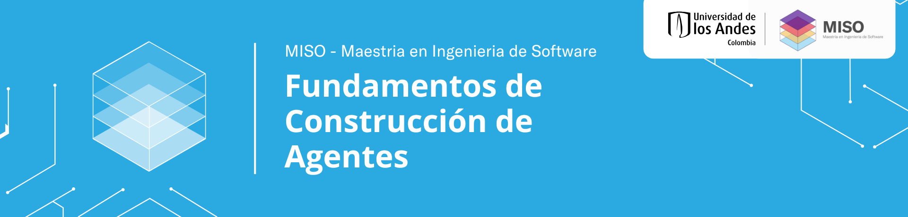
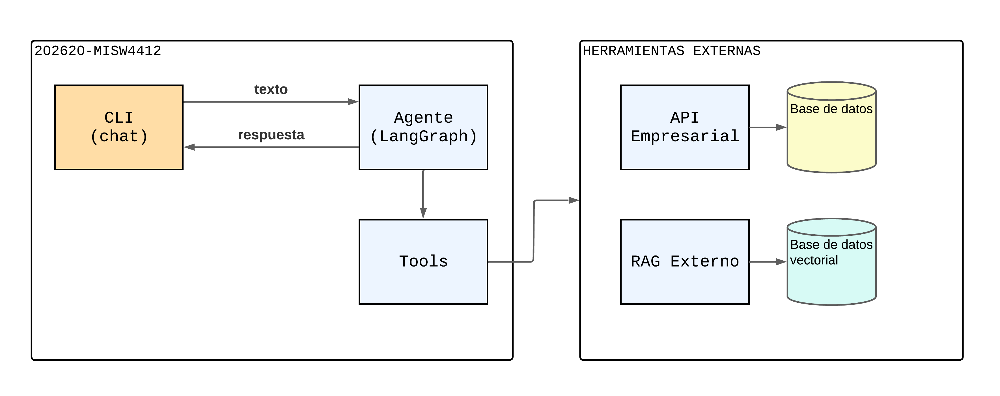

# Agente MISW4412 — Grupo 47 · Caso Centro de Proyectos

Este es el punto de partida del proyecto del curso **MISW4412 —
Fundamentos de Agentes de IA**. A partir de aquí su equipo construye, a lo largo
de las tres entregas del curso, un agente conversacional para el caso de negocio
que le fue asignado: **Centro de Proyectos, Universidad de los Alpes —
Asistente de Evaluación de Convocatorias y Conformación de Equipos**
(caso `centro_proyectos`).

El repositorio ya trae la estructura, el CLI, la configuración y las pruebas
funcionando; **la lógica del agente está por implementar**. Cada semana ustedes
completan una pieza y las pruebas de esa semana pasan de rojo a verde.

---

## Integrantes

| Nombre completo | Correo |
| :--- | :--- |
|  |  |
|  |  |

---

## Tabla de Contenidos

- [Integrantes](#integrantes)
- [1. Requisitos previos](#1-requisitos-previos)
- [2. Puesta en marcha](#2-puesta-en-marcha)
- [3. Desplegar el API empresarial en un puerto](#3-desplegar-el-api-empresarial-en-un-puerto)
- [4. Usar el CLI](#4-usar-el-cli)
  - [Personalizar la interfaz del CLI](#personalizar-la-interfaz-del-cli)
- [5. Estructura del proyecto](#5-estructura-del-proyecto)
- [6. Arquitectura propuesta](#6-arquitectura-propuesta)
- [7. Pruebas y GitHub Actions — `contract.py`](#7-pruebas-y-github-actions--contractpy)
  - [El punto de acople: `contract.py`](#el-punto-de-acople-contractpy)
  - [Un pipeline por semana](#un-pipeline-por-semana)
  - [Correr las pruebas en local](#correr-las-pruebas-en-local)
  - [Un medidor de progreso](#un-medidor-de-progreso)
- [8. Las tres entregas](#8-las-tres-entregas)

---

## 1. Requisitos previos

1. **Python 3.11 o superior.**
2. **Ollama** corriendo en su máquina y un modelo con soporte de *tool calling*:
   ```bash
   ollama serve                 # deja el servidor escuchando en localhost:11434
   ollama pull qwen2.5:3b       # o el modelo seleccionado en semana 1
   ```
3. **API empresarial del curso**, desplegada localmente (ver sección 3). Es una
   API mock que su equipo ejecuta en un contenedor; el repositorio lo entrega el
   equipo docente.

---

## 2. Puesta en marcha

Cree un ambiente virtual, instale las dependencias y prepare su archivo de
configuración local:

```bash
# 1. Ambiente virtual aislado
python -m venv .venv
source .venv/bin/activate          # Windows: .venv\Scripts\activate

# 2. Dependencias (versiones fijadas del curso)
pip install -r requirements.txt

# 3. Instalar el proyecto en modo editable → habilita el comando `agente`
pip install -e .

# 4. Copiar la plantilla de configuración y ajustarla
cp .env.example .env
```

`requirements.txt` es la **única** lista de dependencias del proyecto y fija las
versiones exactas que usa el pipeline del curso. No cambien esas versiones: el CI
instala justo ese archivo.

El archivo `.env` guarda su configuración y credenciales locales y **nunca se
sube al repositorio** (está en `.gitignore`). Use `.env.example` como referencia
de las variables disponibles.

---

## 3. Desplegar el API empresarial en un puerto

El agente consulta y modifica datos a través de una API empresarial. Cada equipo
ejecuta **su propia instancia local** a partir del repositorio de la API que
entrega el equipo docente (hace un *fork* de ese repositorio):

```bash
cd <202620-MISW4412-API-EMPRESARIAL>
docker compose up -d               # levanta la API en http://localhost:8080
```

Por defecto la API queda escuchando en el **puerto 8080**. El agente sabe dónde
encontrarla por la variable `API_BASE_URL` de su `.env`:

```dotenv
API_BASE_URL=http://localhost:8080
```

Si necesita otro puerto (por ejemplo, porque el 8080 está ocupado), cámbielo en
el `docker compose` de la API y actualice `API_BASE_URL` en consecuencia. El
código del agente **nunca** debe llevar la URL escrita a mano: siempre se lee de
la configuración (`get_settings().api_base_url`).

> Además de la API por equipo, el curso ofrece un servicio central de **base
> de conocimiento (RAG)** con información institucional pública. No lo
> despliega cada equipo — corre de forma centralizada, y cada grupo tiene su
> propia cuenta con cuota de consultas propia. Complete estas variables en su
> `.env` (nunca en el código, y nunca suba el `.env` al repositorio):
>
> ```dotenv
> RAG_BASE_URL=http://34.71.149.196:8000/api/v1
> RAG_EMAIL=grupo47_centroproyectos@uniandes.edu.co
> RAG_PASSWORD=centroproyectos178
> RAG_COLLECTION=centro_proyectos
> ```
>
> Estas credenciales son temporales (vigentes durante las primeras semanas
> del curso); si dejan de funcionar más adelante, avise por Slack. El
> detalle de cómo usar estos endpoints desde su agente (login, límites de
> consulta, formato de las respuestas) está en
> [GUIA_ENDPOINTS.md](./GUIA_ENDPOINTS.md).

---

## 4. Usar el CLI

Con el entorno activado y el proyecto instalado (`pip install -e .`), tiene
disponible el comando `agente`:

```bash
agente version           # versión del proyecto
agente config            # muestra la configuración vigente (modelo, API, caso…)
agente herramientas      # lista las herramientas disponibles del agente
agente probar-tool NOMBRE '{"arg": "valor"}'   # invoca una tool sin pasar por el LLM
agente chat              # conversación interactiva con el agente
```

En el esqueleto recién clonado, `agente version` y `agente config` funcionan de
inmediato. `agente herramientas` y `agente chat` le avisarán con un mensaje claro
que **el agente todavía no está implementado**: eso es lo esperado hasta que
completen la semana 2. El CLI está diseñado para arrancar y degradar con
elegancia mientras el agente crece.

### Personalizar la interfaz del CLI

La apariencia del CLI (banner ASCII, colores, símbolo del *prompt*, títulos) se
configura en **`cli_design.toml`**, sin tocar código. Edite ese archivo para
darle a su agente su propia identidad:

```toml
[banner]
title    = "Centro Proyectos"
subtitle = "Evaluacion de Convocatorias y Conformacion de Equipos"
font     = "small"

[colors]
primary = "bright_blue"
agent   = "bright_cyan"

[prompt]
symbol = "equipo ❯ "
```

Todos los campos son opcionales; si se omiten se usan valores por defecto.

---

## 5. Estructura del proyecto

```
202620-MISW4412-GRUPO00-CENTRO-PROYECTOS/
├── contract.py          ← ÚNICO punto de acople con el pipeline (no cambiar firmas)
├── cli/                 ← interfaz de línea de comandos (LISTA, se puede extender)
│   ├── main.py          ·   comandos: chat, config, herramientas, probar-tool
│   ├── config.py        ·   configuración central leída del entorno (.env)
│   └── ui.py            ·   presentación (banner, colores, mensajes)
├── agent/               ← el cerebro del agente (AQUÍ trabajan casi todo)
│   ├── graph.py         ·   [SEMANA 2] construir y compilar el grafo
│   ├── tools.py         ·   [SEMANA 2] herramientas locales del agente
│   ├── mcp_client.py    ·   [SEMANA 2] cliente que carga las tools del servidor MCP
│   ├── memory/          ·   [SEMANA 4] memoria de corto y largo plazo
│   │   ├── checkpointer.py
│   │   └── store.py
│   └── reasoning/       ·   [SEMANA 5] descomposición de tareas (ReAct / Plan-Execute)
│       └── react.py
├── mcp_server/          ← su servidor MCP de acciones
│   └── server.py        ·   [SEMANA 2] arranca con una tool de ejemplo (`ping`)
├── observability/       ← utilidades de trazado con LangSmith
│   └── tracing.py       ·   decorador `trazable` (se aplica en la SEMANA 3)
├── ollama/
│   └── Modelfile.example ·  plantilla opcional para un modelo personalizado
├── tests/               ← las pruebas del curso (una por semana)
├── wiki/                ← plantillas de entrega semanal
├── notebooks/           ← espacio libre para experimentar
├── requirements.txt     ← dependencias (versiones fijas del curso)
├── pyproject.toml       ← empaquetado; define el comando `agente`
├── cli_design.toml      ← personalización visual del CLI
├── .env.example         ← plantilla de configuración (copíela a .env)
└── .github/             ← pipelines de verificación (ver sección 7)
```

Los archivos marcados `[SEMANA N]` son **stubs**: hoy lanzan
`NotImplementedError` con una pista de qué implementar. Al completarlos, las
pruebas de esa semana pasan a verde.

**Ustedes deciden la organización interna.** Los nombres de módulos, funciones y
nodos de arriba son una propuesta: pueden crear archivos, renombrar, dividir o
reagrupar como prefieran. Lo único que no cambia son las **firmas de
`contract.py`** (sección 7).

---

## 6. Arquitectura propuesta

La forma general del proyecto, que el esqueleto ya insinúa:



Ideas que orientan el diseño (el *cómo* se trabaja semana a semana):

- **El CLI ya está resuelto.** Su trabajo es alimentarlo: cuando `build_graph()`
  devuelva un grafo compilado, `agente chat` empezará a conversar.
- **El agente es un grafo** (LangGraph) que alterna entre **razonar** (decidir
  qué hacer con el modelo local) y **ejecutar herramientas**. Diseñar ese ciclo
  y sus nodos es el corazón de la semana 2.
- **Dos familias de herramientas:** *tools locales* (`agent/tools.py`) para
  consultar información, y *tools vía MCP* (`mcp_server/server.py`, cargadas por
  `agent/mcp_client.py`) para ejecutar acciones. Ustedes definen cuáles necesita
  el caso.
- **La configuración es central:** todo lo que cambia entre entornos (modelo,
  URLs, credenciales, caso de negocio) vive en `.env` y se lee vía
  `get_settings()`. Nunca escriban esos valores en el código.
- **Capacidades que llegan después:** observabilidad con LangSmith (semana 3),
  memoria persistente (semana 4) y descomposición explícita de tareas (semana 5).
  Sus stubs ya están ubicados para que sepan dónde irán.

---

## 7. Pruebas y GitHub Actions — `contract.py`

### El punto de acople: `contract.py`

El pipeline del curso **no conoce la arquitectura interna de su agente**. Solo
importa las funciones de **`contract.py`**. Cada función es normalmente una línea
que reexporta su implementación real:

```python
def build_agent_graph(checkpointer=None):
    from agent.graph import build_graph      # ← importe DENTRO de la función
    return build_graph(checkpointer=checkpointer)
```

Esto les da total libertad: pueden organizar su código en los archivos y con los
nombres que quieran, siempre que `contract.py` sepa dónde encontrar cada pieza.
La única regla es **no cambiar los nombres ni las firmas de las funciones de
`contract.py`** — si el CI no las encuentra, falla. Sí deben cambiar lo que hay
adentro (los `import`). Como los `import` van dentro de cada función, si el
código de una semana aún no compila, solo fallan las pruebas de esa semana.

### Un pipeline por semana

En `.github/pipelines/` hay una plantilla por semana (`semana1.yml` …
`semana5.yml`), todas **inactivas**. GitHub solo ejecuta lo que esté en
`.github/workflows/`, donde debe haber **siempre un único archivo**:
`entrega.yml`. El esqueleto arranca con la **semana 1** activada.

Para avanzar de semana, sobrescriba el pipeline activo:

```bash
cp .github/pipelines/semana2.yml .github/workflows/entrega.yml
git add .github/workflows/entrega.yml
git commit -m "Activar pipeline de la semana 2"
git push
```

Cada push ejecuta `pip install -r requirements.txt` y luego `pytest` de la
semana correspondiente. **El CI nunca invoca el LLM, ni la API, ni descarga
modelos:** solo comprueba que las piezas de la semana existen y tienen la forma
esperada. Ver [.github/pipelines/README.md](./.github/pipelines/README.md).

### Correr las pruebas en local

Antes de hacer push, con el ambiente activado y sin gastar minutos de Actions:

```bash
pytest -m semana1      # ambiente, CLI y configuración
pytest -m semana2      # herramientas, grafo y servidor MCP
pytest -m semana3      # observabilidad (requiere credencial de LangSmith)
pytest -m semana4      # memoria persistente
pytest -m semana5      # descomposición de tareas
```

### Un medidor de progreso

Recién clonado, **`pytest -m semana1` pasa en verde** aunque no hayan
implementado nada del agente: el ambiente y el CLI ya funcionan. Las demás
semanas están en rojo a propósito — son la lista de lo que falta. A medida que
completan cada pieza, su semana se vuelve verde. Ese es el pulso del proyecto.

---

## 8. Las tres entregas

El proyecto se construye sobre el mismo caso a lo largo del curso, con tres
entregas acumulativas:

| Entrega | Semanas | Foco |
| :--- | :--- | :--- |
| Primera entrega | 1 – 3 | Agente base: CLI, herramientas, grafo, observabilidad |
| Segunda entrega | 4 – 5 | Memoria y descomposición de tareas |
| Entrega final   | 6 – 8 | Integración y cierre del caso |

Cada entrega se documenta en la `wiki/` del repositorio.

---


**Curso**: MISW4412 - Fundamentos de Construcción de Agentes
**Universidad**: Universidad de los Andes - Maestría en Ingeniería de Software  
**Año**: 2026-20

---

**¡Éxitos en sus Proyectos!**
